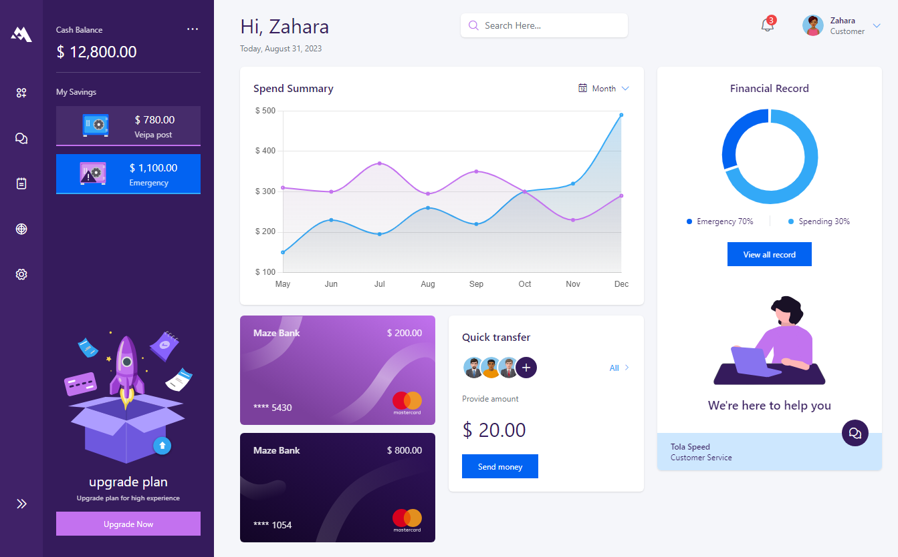

<h1 align="center">Banking Dashboard</h1>

<p align="center"></p>

<h3 align="center">
The frontend implementation of a banking dashboard by UI designer, <a href="https://dribbble.com/shots/17074960-Banking-Dashboard-Design"></a>. Implemented with Vue.js, Chart.js, TailwindCSS.
</h3>

<br>

<h3>
<a href="https://bankingdashboard.netlify.app" target="_blank">View it in action.</a>

<a href="https://mkfrontends.netlify.app/" target="_blank">Check the collection of other UI/UX designs I have brought to life.</a>
</h3>
<br>

## Customize configuration

See [Vite Configuration Reference](https://vitejs.dev/config/).

## Project Setup

```sh
npm install
```

### Compile and Hot-Reload for Development

```sh
npm run dev
```

### Compile and Minify for Production

```sh
npm run build
```
